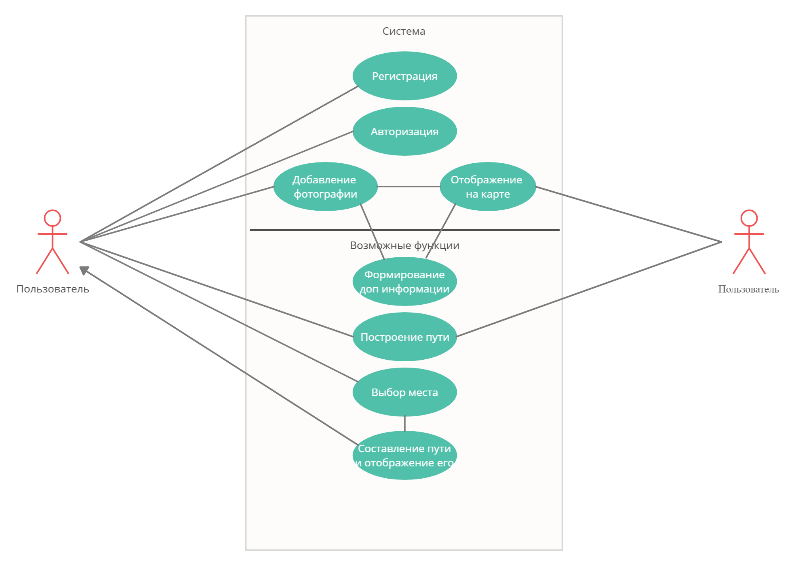

# Цифровой гид - BrightSpot

## 1. Область применения

Туризм

## 2. Схема системы

## 3. Функции системы

Основные:
- Поиск интересных мест при помощи фотографий с геолокацией других пользователей
- Сохранение фотографий с геолокацией и возможностью поделиться ими в дальнейшем

Возможные:
- Построение пути к выбранному месту
- Вывод дополнительной информации о условиях для фотографий (Время суток, погода и т.д.)
- Рекомендации к настройке камеры телефона для получения наилучшего результата (Маловероятна)
- Создание пути для обхода наиболее интересных мест, по мнению пользователя, с возможностью поделиться с другими людьми

## 4. Аналоги

Классификация по функционалу:
- Возможность делиться фотографиями:
    - Instagram
    - Другие социальные сети
- Поиск мест в городе:
    - Google Карты
    - Яндекс.Карты
- Гид по городу:
    - izi. Travel гид-путеводитель
    - Maps.me
    - И т.д.

## 5. Схема потоков данных

